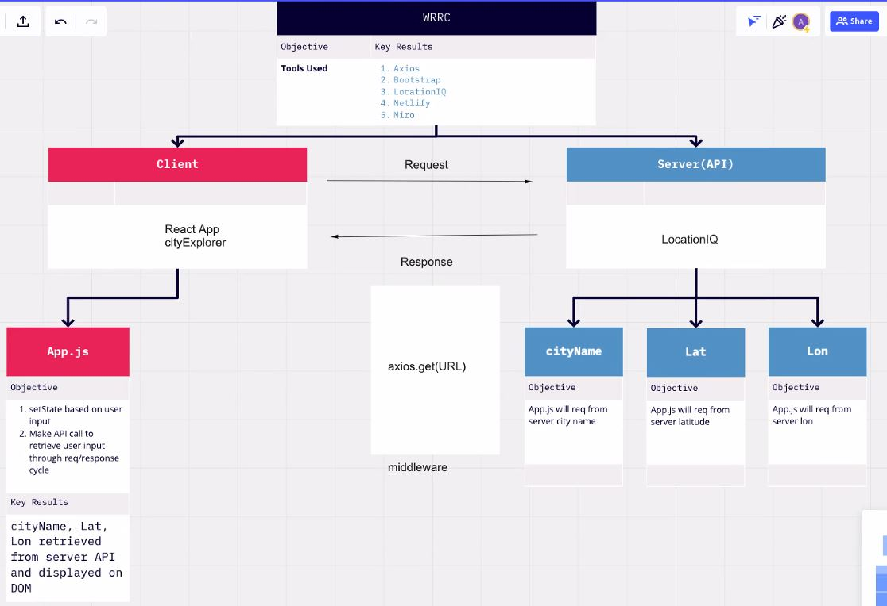

# Project Name: City Explorer

**Author**: Jeff Inman
**Version**: 1.0.0 (increment the patch/fix version number if you make more commits past your first submission)
**Netlify Link**: [The City Explorer](the-city-explorer.netlify.app)
**Project Trello Board**: [City Explorer Trello](https://trello.com/b/Xsm3RhAU/module-2-city-explorer)

## Overview
This App is meant to provide a user a search bar, and the ability to input city data into the search bar and return results from an API.

## Getting Started
<!-- What are the steps that a user must take in order to build this app on their own machine and get it running? -->

## Architecture
- React
- Bootstrap
- API LocationIQ

## Change Log
<!-- Use this area to document the iterative changes made to your application as each feature is successfully implemented. Use time stamps. Here's an example:

01-01-2001 4:59pm - Application now has a fully-functional express server, with a GET route for the location resource. -->

## Credit and Collaborations
Accountability Partner: Angela D.

Name of feature: ________________________________

Estimate of time needed to complete: _____

Start time: _____

Finish time: _____

Actual time needed to complete: _____

